# 数学建模智能答疑 Agent — 产品需求文档 (PRD)

# 0. 文档信息

### 0.1 文档状态

- **当前版本**: `v3.1`
- **当前阶段**: `开发中`
- **创建人**: `AI Agent`
- **创建日期**: `2026-02-12`
- **最后更新**: `2026-03-04`
- **核心干系人**: `产品经理、后端研发 (Python/FastAPI)、前端研发 (HTML/CSS/JS)、AI 算法工程师、测试`

### 0.2 更新记录

| 版本号 | 版本状态 | 更新人 | 更新日期 | 核心更新内容 |
| :--- | :--- | :--- | :--- | :--- |
| 1.0 | 需求初稿 | AI Agent | 2026-02-12 | 初步阐述需求背景、目标和核心价值，引入 Agentic RAG 概念 |
| 1.3 | 方案评审稿 | AI Agent | 2026-02-12 | 引入 Camel AI 多智能体框架，定义 6 种 Agent 角色与四阶段工作流 |
| 1.4 | 方案评审稿 | AI Agent | 2026-02-12 | 补充 JSON 通信协议、系统提示词、错误处理策略、API 端点 |
| 1.7 | 方案评审稿 | AI Agent | 2026-02-12 | 深度融合 MCM/CUMCM 规则，细化题型分类、策略模板、LLM 选型 |
| 1.9 | 开发交付稿 | AI Agent | 2026-02-12 | 补充 DB Schema (ER 图)、WebSocket 协议、安全策略、监控体系 |
| 2.0 | 开发交付稿 | AI Agent | 2026-02-13 | 按标准 PRD 模板重构全文，补充用户故事、需求列表、埋点方案、上线计划 |
| 2.1 | 开发交付稿 | AI Agent | 2026-02-13 | 写入前端实现规范：设计令牌、文件结构、4 页面详细规格、i18n/主题/响应式 |
| 2.2 | 架构升级稿 | AI Agent | 2026-02-13 | **重大架构变更**: 对标 OpenManus 架构，从多 Agent Orchestrator 改为单一 MathModelingAgent + PlanningFlow，新增 Agent Loop / Tool Registry / Memory 管理 / PlanStepStatus |
| 2.3 | 前端重构稿 | AI Agent | 2026-02-21 | **前端重构**: 从 React/Vite/TypeScript/TailwindCSS 迁移至纯静态 HTML5 + CSS3 + Vanilla JS，删除所有构建工具依赖，更新前端技术栈与页面规范 |
| 2.4 | E2E 测试修复 | AI Agent | 2026-02-21 | **E2E 测试**: 使用 2024 APMCM Problem A 实测全流程，修复 4 个 Bug (配置加载/前端刷新/上下文溢出) |
| 3.0 | 记忆系统重构 | AI Agent | 2026-02-27 | **双层记忆系统**: 引入 ShortTermMemory + LongTermMemory + MemoryManager 架构（灵感来源 memU），取代原始字符串拼接上下文，新增 LLM 阶段综合报告、跨阶段知识持久化；更新数据库模型（MemoryItem + ShortTermMemoryEntry）；PlanningFlow 完整集成 MemoryManager |
| 3.1 | 环境兼容升级 | AI Agent | 2026-03-04 | **环境 & 沙箱重构**: Python 3.9→3.11 虚拟环境重建；camel-ai 0.2.89 兼容修复（FunctionTool/OPENAI_COMPATIBLE_MODEL）；接入阿里巴巴 OpenSandbox 自托管沙箱（opensandbox 0.1.5）作为主选，E2B 保留为备选；代码执行三级降级链（OpenSandbox→E2B→本地）；更新 SandboxConfig 及 .env |

### 0.3 相关文档

- **领域调研文档**: [数学建模.md](file:///Users/micheal024/code/math/docs/%E6%95%B0%E5%AD%A6%E5%BB%BA%E6%A8%A1.md) — 竞赛规则、题型分析、技术方案调研
- **PRD 模板**: [产品需求文档 (PRD) 标准模板.md](file:///Users/micheal024/code/math/docs/%E4%BA%A7%E5%93%81%E9%9C%80%E6%B1%82%E6%96%87%E6%A1%A3%20%28PRD%29%20%E6%A0%87%E5%87%86%E6%A8%A1%E6%9D%BF.md)
- **交互原型 (Figma)**: `[待补充]`
- **技术方案设计文档**: `[待补充]`

### 0.4 名词解释

| 术语 | 解释 |
| :--- | :--- |
| **OpenManus** | 开源 AI Agent 框架 (MIT)，对标 Manus AI，提供 BaseAgent→ReActAgent→ToolCallAgent→Manus 继承链 |
| **Agent Loop** | 核心执行循环: think() (LLM 推理) → act() (工具执行) → observe (结果回写 Memory) |
| **PlanningFlow** | 任务编排器，使用 LLM 将复杂任务分解为多步骤计划，逐步交给 Agent 执行 |
| **ToolCallAgent** | OpenManus 的工具调用 Agent 基类，支持 LLM Function Calling 自动选择和执行工具 |
| **MathModelingAgent** | 本项目自定义的数学建模 Agent，继承 ToolCallAgent，集成 11 种领域工具 |
| **Agentic RAG** | 自主代理式检索增强生成，Agent 能主动规划检索策略并验证结果 |
| **ToT** | Tree of Thoughts，思维树搜索算法，用于生成多条候选推理路径 |
| **E2B** | 云端安全沙箱，用于隔离执行用户/Agent 生成的 Python 代码 |
| **Gate** | 用户确认节点，通过 AskHuman 工具实现，需用户 Approve 后流程才可继续 |
| **Blueprint** | 解题蓝图，由 MathModelingAgent 在策划步骤中生成的结构化解题方案 |
| **PlanStepStatus** | 步骤状态枚举: NOT_STARTED / IN_PROGRESS / COMPLETED / BLOCKED |
| **MCM/ICM** | 美国大学生数学建模竞赛 / 交叉学科建模竞赛 |
| **CUMCM** | 全国大学生数学建模竞赛 |
| **KaTeX** | 高性能 LaTeX 公式渲染引擎 |
| **pgvector** | PostgreSQL 向量检索扩展，用于语义搜索 |
| **ShortTermMemory** | 短期记忆层：有界（6000字/阶段）、会话级、阶段切换时清空；提供"当前阶段最近步骤"上下文 |
| **LongTermMemory** | 长期记忆层：项目级持久化、重要性评分；存储阶段综合报告（synthesis=2.0）、用户决策（1.8）等；跨会话保留 |
| **MemoryManager** | 记忆协调器：PlanningFlow 唯一记忆入口；调用 LLM 对阶段步骤进行综合，生成高质量阶段报告（取代原始步骤拼接） |
| **Phase Synthesis** | 阶段综合：MemoryManager 在每阶段结束后调用 LLM，将所有步骤结果整合为连贯的专业报告，存储于 LongTermMemory（importance=2.0） |

---

## 一、 需求背景与目标

### 1.1 项目概述

本项目旨在设计并开发一款**对标 Manus AI / OpenManus 架构**的数学建模智能 Agent。系统采用 **单一通用 Agent (MathModelingAgent) + PlanningFlow 任务编排** 模式，通过 Agent Loop (think→act→observe) 循环，配合 11 种数学建模专用工具，覆盖从"破题→策划→代码→论文"的全流程。核心理念是 **"思考即服务 (Thinking as a Service)"** —— Agent 通过自主规划和工具调用完成深度推理，用户可实时观察 Agent 的思考过程和工具执行结果。

### 1.2 要解决的核心问题 (Problem Statement)

- **目标用户画像**:

| 用户类型 | 描述 | 规模 |
| :--- | :--- | :--- |
| **竞赛学生** | 参加 MCM/ICM, CUMCM, APMCM 等竞赛的大学生/研究生 | 全国 3000+ 高校 |
| **指导教师** | 高校数学建模课程教师和竞赛指导教师 | 数万人 |
| **专业人士** | 数据科学家、运筹学工程师 | 补充市场 |

- **用户场景 (Scenario)**: 在数学建模竞赛的 72-96 小时内，3 人团队需要完成从理解问题、查阅文献、选择算法、编写代码、撰写论文到格式化导出的全部任务。时间紧迫，且队伍缺乏经验，往往在"选哪个模型"和"代码怎么写"上卡壳。

- **核心痛点 (Pain Point)**:
  1. **破题难**: 面对开放式赛题，不知从何入手分析问题结构，难以提取关键变量和约束。
  2. **选模型难**: 不清楚哪种数学模型/算法最适合当前问题，缺乏横向对比能力。
  3. **写代码难**: 即使选定了算法，也难以从零实现，尤其是调参和调试过程。
  4. **写论文难**: 论文结构不规范，格式不合规（页数、字体、禁词），在交付最后一步"翻车"。
  5. **缺乏一致性**: 代码实现偏离了最初的模型设计，团队内部协调成本高。

### 1.3 用户故事 (User Stories)

- **US-01**: 作为一名**竞赛学生**，我想要**上传一道 MCM 赛题，系统自动将其拆解为目标函数、约束条件和决策变量**，以便于**快速建立对问题的结构化理解，而不用花 2 小时手动梳理**。
- **US-02**: 作为一名**竞赛学生**，我想要**看到 3 种不同难度的解题策略对比表**，以便于**根据团队实力和时间选择最合适的技术路线**。
- **US-03**: 作为一名**竞赛学生**，我想要**Agent 帮我写出算法代码并在沙箱中验证运行**，以便于**在代码实现阶段节省 50% 的时间**。
- **US-04**: 作为一名**竞赛学生**，我想要**Agent 自动检查我的论文是否超过 25 页、是否包含校名等禁词**，以便于**避免因格式违规被取消参赛资格**。
- **US-05**: 作为一名**指导教师**，我想要**查看 Agent 的完整推理过程**，以便于**判断学生是否真正理解了建模方法，而不是盲目依赖 AI**。
- **US-06**: 作为一名**竞赛学生**，我想要**Agent 自动确保代码实现与我确认的策略蓝图一致**，以便于**避免代码写跑偏了方向，浪费宝贵的竞赛时间**。

### 1.4 项目目标与价值

- **用户价值**:
  - 将破题时间从 **2小时缩短至 15分钟**。
  - 代码实现阶段效率提升 **50%**。
  - 论文格式合规率达到 **100%**（消灭低级错误导致的淘汰）。
- **商业价值**:
  - 建立"AI+数学建模"垂直赛道的技术壁垒。
  - 累积高质量竞赛知识库 (RAG 向量库)，形成数据飞轮。
- **项目目标 (SMART)**:
  - **S**: 上线后 3 个月内，注册用户达到 5000 人。
  - **M**: 通过埋点追踪各阶段 Gate 通过率、代码一次运行成功率、NPS 评分。
  - **A**: 基于 Camel AI 开源框架和 MiniMax-M1 模型，技术栈成熟可控。
  - **R**: 与"降低竞赛参与门槛"的市场趋势一致。
  - **T**: 在 2026 年 9 月 CUMCM 赛季前上线 MVP。

### 1.5 需求范围

- **In-Scope (范围内)**:
  1. 题目上传 (PDF/Text/Image) 与结构化解析
  2. 基于 RAG 的智能文献检索与推荐
  3. Tree of Thoughts 多路径策略生成
  4. Python 代码生成、沙箱执行、自修复
  5. 代码与蓝图的一致性审查
  6. Canvas 协同写作编辑器 (Markdown + LaTeX)
  7. 多格式导出 (PDF / Word / LaTeX) 与合规检查
  8. Agent 思考过程的实时可视化
- **Out-of-Scope (范围外)**:
  1. ❌ 生成可直接提交的完整竞赛论文（维护学术诚信）
  2. ❌ 实时竞赛答案服务
  3. ❌ 多人实时协同编辑 (WebSocket CRDT) —— 暂排入 V2.0
  4. ❌ MATLAB 代码执行 —— 仅支持 Python

### 1.6 需求列表 (Requirements List)

| 需求ID | 模块 | 需求描述 | 优先级 | 状态 |
| :--- | :--- | :--- | :--- | :--- |
| R001 | 破题 | 用户上传 PDF/Text/Image 题目，系统 NLP 提取结构化信息 | **P0** | 规划中 |
| R002 | 破题 | 自动分类题型 (Continuous/Discrete/Data/Interdisciplinary) | **P0** | 规划中 |
| R003 | 破题 | RAG 文献检索 (Semantic Scholar + Vector DB)，返回 5-10 篇 | **P0** | 规划中 |
| R004 | 破题 | 生成《题目理解报告》并设 Gate 1 用户确认 | **P0** | 规划中 |
| R005 | 策划 | Tree of Thoughts 生成 3 种解题策略 (经典/进阶/创新) | **P0** | 规划中 |
| R006 | 策划 | Programmer 预判技术可行性，蓝图冻结后不可修改 | **P0** | 规划中 |
| R007 | 代码 | 科学程序员在 E2B 沙箱写代码并执行 | **P0** | 规划中 |
| R008 | 代码 | 代码运行失败时自修复 (最多 3 次) | **P1** | 规划中 |
| R009 | 代码 | 一致性审查员检查代码是否偏离蓝图 | **P0** | 规划中 |
| R010 | 论文 | Canvas 块级编辑器，支持 Markdown + KaTeX 公式 | **P0** | 规划中 |
| R011 | 论文 | @Mention 召唤 Agent (编辑/程序员) 进行 Co-pilot 写作 | **P1** | 规划中 |
| R012 | 论文 | 合规检查 (页数/禁词/引用/AI声明) | **P0** | 规划中 |
| R013 | 论文 | 多格式导出：PDF (xelatex) + Word + LaTeX 源码 | **P0** | 规划中 |
| R014 | 通用 | Agent 思考过程实时可视化 (WebSocket 推送) | **P1** | 规划中 |
| R015 | 通用 | 用户 Gate 决策 (Approve/Edit/Reject) | **P0** | 规划中 |

---

## 二、 方案概述

### 2.1 核心业务流程图 (Business Flow) — 对标 Manus Agent Loop

> [!IMPORTANT]
> 本系统对标 [OpenManus](https://github.com/FoundationAgents/OpenManus) 架构，采用 **单一通用 Agent + PlanningFlow 编排** 模式，而非传统的多 Agent Orchestrator 模式。

```mermaid
flowchart TB
    User([👤 用户输入任务]) --> PF[📋 PlanningFlow]
    
    PF --> |"1. create_initial_plan()"| Plan[LLM 分解为 N 个步骤]
    Plan --> Loop{还有未完成的步骤?}
    
    Loop --> |Yes| GetStep["get_current_step()"]
    GetStep --> Agent[🤖 MathModelingAgent]
    
    subgraph AgentLoop ["Agent Loop (think → act → observe)"]
        Agent --> Think["think(): LLM 分析状态 + 选择工具"]
        Think --> Act["act(): 执行工具 (Python/Browser/Editor)"]
        Act --> Observe["observe: 结果写入 Memory"]
        Observe --> |"step < max_steps"| Think
        Observe --> |"Terminate / 完成"| StepDone["step_result"]
    end
    
    StepDone --> Mark["mark_step_completed()"]
    Mark --> Loop
    
    Loop --> |No| Finalize["finalize_plan() → 汇总结果"]
    Finalize --> Output([📦 交付: 报告/代码/论文])

    style AgentLoop fill:#1a1a2e,stroke:#e94560,stroke-width:2px
    style PF fill:#0f3460
    style Agent fill:#16213e,stroke:#0f3460
```

**流程说明**:
1. 用户输入一道数学建模赛题 (PDF/Text/Image)
2. **PlanningFlow** 使用 LLM 将任务自动分解为多个步骤 (如: "分析题目" → "检索文献" → "生成策略" → "编写代码" → ...)
3. 逐步执行: 每个步骤由 **MathModelingAgent** 通过 Agent Loop 完成
4. Agent Loop 每轮: `think()` (LLM 决策选工具) → `act()` (执行工具) → `observe` (结果回写 Memory)
5. 步骤完成后标记 `completed`，进入下一步；全部完成后汇总交付

### 2.2 Agent 层级架构 (对标 OpenManus)

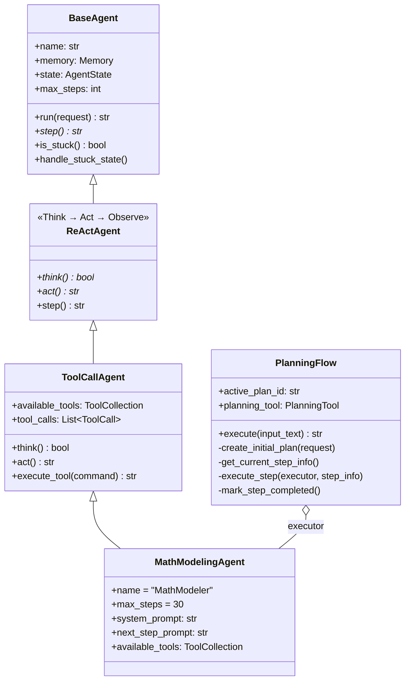

**各层职责**:

| 层级 | 来源 | 职责 |
| :--- | :--- | :--- |
| `BaseAgent` | OpenManus | 状态机 (IDLE→RUNNING→FINISHED)、step 循环、卡死检测、Memory 管理 |
| `ReActAgent` | OpenManus | 实现 Think → Act → Observe 循环模式 |
| `ToolCallAgent` | OpenManus | LLM Tool Calling 集成、工具执行、结果截断 (max_observe)、特殊工具处理 |
| `MathModelingAgent` | **自定义** | 数学建模专用 Agent，集成所有领域工具 (文献检索/Python沙箱/LaTeX编译等) |
| `PlanningFlow` | OpenManus | 任务编排：创建计划 → 逐步执行 → 标记完成 → 汇总结果 |

**图注**: 与 Manus/OpenManus 的关键区别在于 `MathModelingAgent` 层——它继承了通用的 ToolCallAgent，但内置了数学建模领域的专用工具集和定制化 System Prompt。

### 2.3 信息架构图 (IA)

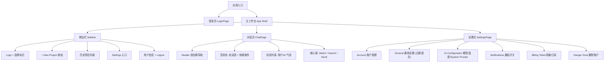

### 2.4 前端技术栈与设计规范 (Frontend Design System)

#### 2.4.1 前端技术栈

| 层级 | 技术 | 用途 |
| :--- | :--- | :--- |
| **结构** | HTML5 | 语义化页面结构 |
| **样式** | CSS3 (Custom Properties) | 设计令牌 + 主题切换 + 动画 + 响应式布局 |
| **逻辑** | Vanilla JavaScript (ES2022) | 状态管理 + 路由 + 渲染 + 事件绑定 |
| **通信** | WebSocket + Fetch API | 实时 Agent 交互 + REST 数据获取 |
| **图标** | 内联 SVG | 轻量图标库 (无外部依赖) |
| **字体** | Inter (Google Fonts) | 权重: 300/400/500/600/700 |
| **开发服务器** | `python -m http.server 3000` | 零依赖静态文件服务 (开发) |

> [!NOTE]
> v2.3 移除了 React、Vite、TypeScript、TailwindCSS、Framer Motion 等构建时依赖，采用纯静态方案，无需 `npm install` 或任何构建步骤。

#### 2.4.2 设计令牌 (Design Tokens)

使用 **CSS Custom Properties** 实现 Light / Dark 双主题切换，切换方式为 `<html>` 标签添加 `class="dark"`。

| Token | Light Mode | Dark Mode | 用途 |
| :--- | :--- | :--- | :--- |
| `--bg-background` | `#ffffff` | `#000000` (OLED 纯黑) | 全局背景 |
| `--bg-surface` | `#fdfdfd` | `#0f0f11` | 卡片/面板背景 |
| `--bg-surface-hover` | `#f4f4f5` | `#27272a` | 悬停态 |
| `--border-color` | `#e4e4e7` | `#27272a` | 边框 |
| `--text-primary` | `#18181b` | `#ffffff` | 主要文字 |
| `--text-secondary` | `#52525b` | `#a1a1aa` | 次要文字 |
| `--text-muted` | `#a1a1aa` | `#71717a` | 占位/辅助文字 |
| `--accent` | `#18181b` | `#ffffff` | 按钮/强调色 |
| `--accent-foreground` | `#ffffff` | `#000000` | 强调色前景 |
| `--glow-color` | `rgba(99,102,241,0.15)` | `rgba(99,102,241,0.2)` | 输入框辉光 |
| `--success-color` | `#22c55e` | `#4ade80` | 连接成功/成功状态 |
| `--error-color` | `#ef4444` | `#f87171` | 错误状态 |
| `--warning-color` | `#eab308` | `#facc15` | 警告/AskHuman 边框 |

**设计特征**:
- **OLED 纯黑背景** — Dark Mode 使用 `#000000`，极致对比
- **Glassmorphism 玻璃态** — `backdrop-filter: blur(20px)` + 半透明边框
- **网格纹理** — 40×40px 格子背景，Login 页用做视觉点缀
- **CSS Keyframe 动画** — `fadeIn`, `fadeInScale`, `bounce`, `spin` 等，替代 Framer Motion
- **Blue Ambient Glow** — 蓝色发光效果用于 Login 页面聚焦 (`filter: blur(120px)`)

#### 2.4.3 文件结构

```
front/
├── index.html   # 入口 HTML (含 meta 标签 + CSS/JS 引入)
├── styles.css   # 完整设计系统 (CSS Variables + 布局 + 动画 + 响应式)
├── app.js       # 核心应用逻辑 (状态管理 + 路由 + 渲染 + i18n + 事件绑定)
├── ws.js        # WebSocket 客户端 (AgentWebSocket 类 + 自动重连)
└── api.js       # REST API 客户端 (projects/chat/artifacts)
```

#### 2.4.4 状态管理

使用 **全局 JS 对象 `state`** 管理应用状态 (无框架依赖):

| 状态字段 | 类型 | 说明 |
| :--- | :--- | :--- |
| `currentView` | `'login' \| 'chat' \| 'settings'` | 当前页面视图 |
| `sidebarOpen` | `boolean` | 侧边栏展开/收起状态 |
| `isConnected` | `boolean` | WebSocket 连接状态 |
| `agentStatus` | `'idle' \| 'thinking' \| 'executing' \| 'error'` | Agent 执行状态 |
| `messages` | `Array` | 当前对话消息列表 (含 type: text/thought/tool_call/ask_human/error) |
| `projects` | `Array` | 项目列表 (从 REST API 获取) |
| `currentProjectId` | `string?` | 当前选中项目 ID |
| `artifacts` | `Array` | 当前项目制品列表 |
| `settings` | `Object` | 用户设置 (theme/language/model/temperature/name/email 等) |

**路由方式**: 状态驱动视图切换 (`state.currentView`)，通过 `navigate()` 函数切换并触发 `render()`。

| ViewState | 显示页面 |
| :--- | :--- |
| `login` | 登录页 (全屏, 无 Sidebar) |
| `chat` | Sidebar + ChatPage |
| `settings` | Sidebar + SettingsPage |

### 2.5 页面规范 (Page Specifications)

#### 2.5.1 登录页 (LoginPage)

| 属性 | 值 |
| :--- | :--- |
| **布局** | 全屏居中, 无 Sidebar |
| **背景** | CSS 网格纹理 (`.grid-bg`) + 蓝色模糊辉光 (500×500px, `filter: blur(120px)`) |
| **卡片** | `max-width: 420px`, 圆角 20px, 玻璃态 (`backdrop-filter: blur(20px)`), CSS `fadeInScale` 动画入场 |

**组件清单**:

| 组件 | 说明 |
| :--- | :--- |
| Logo | 圆角方形深色底 + 白色 "M" |
| 标题 | "Welcome back" / "欢迎回来" (i18n) |
| 副标题 | "Sign in to continue to MathModeler" |
| Email 输入框 | 圆角 12px, 聚焦时 `box-shadow` 辉光效果 |
| Password 输入框 | 同上, `type="password"` |
| Sign In 按钮 | 全宽, `bg: var(--accent)`, 点击后加载项目列表并跳转到 Chat |
| Google 登录 | 分割线下方, 带 Google SVG 图标 |
| 条款声明 | Terms of Service + Privacy Policy 链接 |

#### 2.5.2 侧边栏 (Sidebar)

| 属性 | 值 |
| :--- | :--- |
| **宽度** | 展开: 260px, 收起: 0px (CSS transform) |
| **动画** | CSS `transition: transform 0.3s cubic-bezier(0.4, 0, 0.2, 1)` |
| **桌面 (≥768px)** | `position: relative`, 无遮罩 |
| **移动端 (<768px)** | `position: fixed` + `z-index: 50` + 黑色半透明遮罩 (`backdrop-filter: blur(4px)`) |

**区域划分**:

| 区域 | 内容 |
| :--- | :--- |
| **Header** | Logo "M" 圆标 + "MathModeler" 文字 + LayoutGrid 切换按钮 |
| **New Project** | 全宽按钮, Plus SVG 图标, 点击调用 REST API 创建项目 |
| **History** | 可滚动项目列表 (从 `/api/v1/projects` 获取), 各条目带 MessageSquare 图标 |
| **Footer** | Settings 入口 + 分隔线 + 用户头像 (紫蓝渐变) + 名称/套餐 + Logout |

#### 2.5.3 对话页 (ChatPage)

| 属性 | 值 |
| :--- | :--- |
| **布局** | 垂直三段: Header (56px) + Content (flex-1, 含 Chat + Artifacts 面板) + Input (底部) |
| **Header** | 面包屑 (Menu + "/" + 连接状态指示器) + 工具栏 (Zap + Settings) |

**空状态** (无消息时):

| 组件 | 说明 |
| :--- | :--- |
| 标题 | "What can I do for you?" / "我能为您做什么？" (i18n) |
| 副标题 | 产品能力描述 |
| 快捷操作 | 3 个 Chip 按钮 (CSS `fadeIn` 动画) |

**消息列表** (有消息时) — 5 种消息类型:

| 类型 | 样式 | 说明 |
| :--- | :--- | :--- |
| `text` (用户) | 靠右气泡, `bg-surface-hover`, 右上圆角缩小 | 用户发送的普通文本 |
| `text` (AI) | 靠左气泡, `bg-surface`, 左上圆角缩小 | Agent 最终回复 |
| `thought` | 斜体, Brain 图标, 半透明 | Agent think() 过程 |
| `tool_call` | Terminal 图标 + 工具名 (monospace) + Spinner | Agent 正在执行工具 |
| `ask_human` | 黄色边框卡片 + 输入框 + 发送按钮 | AskHuman Gate, 用户需回复 |
| `error` | 红色边框, ⚠️ 图标 | 执行错误 |

**Typing 指示器**: 三个 bounce 动画小圆点 (CSS `animation-delay: 0/0.15s/0.3s`)

**输入区域**:

| 组件 | 说明 |
| :--- | :--- |
| 容器 | 圆角 16px, `bg-surface`, 聚焦时辉光效果 (`input-glow`) |
| 输入框 | `<textarea>`, JS 自适应高度 (min 48px, max 150px), Enter 发送, Shift+Enter 换行 |
| 附件按钮 | Paperclip SVG 图标 |
| 搜索模式 | Search SVG 图标 |
| 发送按钮 | Send SVG, `bg: var(--accent)`, disabled 态半透明 |
| 免责声明 | "MathModeler can make mistakes." |

**Artifacts 面板** (右侧, >1024px 可见):

| 属性 | 值 |
| :--- | :--- |
| **宽度** | 320px, 左边框分隔 |
| **内容** | 制品卡片列表 (type badge 带不同颜色: report=蓝, blueprint=紫, code=绿, paper=橙) |
| **隐藏** | 移动端 (<1024px) 自动隐藏 |

#### 2.5.4 设置页 (SettingsPage)

| 属性 | 值 |
| :--- | :--- |
| **布局** | 单栏, `max-width: 680px` 居中, 可滚动 |
| **Header** | 同对话页 Header (Menu + "Settings" + "Back to Chat" 返回按钮) |

**6 个分区面板** (每个为圆角 16px 卡片 + 图标标题栏):

| Section | 图标 (SVG) | 内容 |
| :--- | :--- | :--- |
| **Account** | User | 头像 (紫蓝渐变 + 首字母) + Change Avatar 按钮 + Name/Email 输入 |
| **General** | Monitor | Theme 下拉 (light/dark/system) + Language 下拉 (English/中文) |
| **AI Configuration** | CPU | Model 下拉 (GPT-4o/DeepSeek/Qwen/Doubao) + Temperature 滑条 (0-1, 步进 0.1) |
| **Notifications** | Bell | Marketing Emails Toggle + Security Alerts Toggle (CSS 滑块开关) |
| **Billing & Usage** | CreditCard | 当前套餐信息 |
| **Danger Zone** | Shield | 删除账户按钮, 红色主题 |

#### 2.5.5 国际化 (i18n)

使用 `app.js` 内置的 `translations` 对象 (JS Object) 支持双语:

| 语言 | 覆盖范围 |
| :--- | :--- |
| **English** | 全部 UI 文案 (默认) |
| **Chinese** | 全部 UI 文案 (侧边栏/对话/登录/设置) |

切换方式: Settings → General → Language 下拉选择，触发 `render()` 全量重绘，实时生效。

#### 2.5.6 主题切换

| 模式 | 行为 |
| :--- | :--- |
| `light` | `<html>` 移除 `dark` class，使用 `:root` 变量 |
| `dark` | `<html>` 添加 `dark` class (默认)，使用 `html.dark` 变量 |
| `system` | JS 监听 `matchMedia('prefers-color-scheme: dark')` 变化事件, 跟随系统 |

切换方式: Settings → General → Theme 下拉选择。通过 `applyTheme()` 函数实时修改 DOM class。

#### 2.5.7 响应式策略

| 断点 | Sidebar | 布局 |
| :--- | :--- | :--- |
| `< 768px` (Mobile) | 默认收起, 点击 Menu 展开 (`position: fixed` + overlay) | 单栏, padding 缩小 |
| `≥ 768px` (Desktop) | 默认展开, `position: relative` | Sidebar + Content 并排 |
| `< 1024px` | Artifacts 面板隐藏 | Chat 单列 |

使用 `100dvh` 适配移动端浏览器地址栏。

### 2.6 Agent 运行机制 (Agent Loop)

#### 2.6.1 think → act → observe 循环

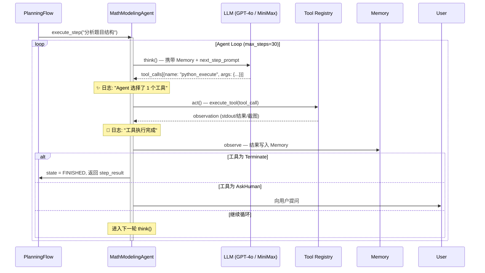

#### 2.6.2 AgentState 状态机

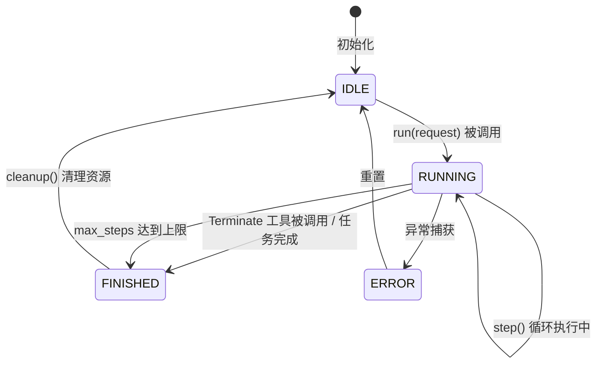

| 状态 | 含义 | 触发条件 |
| :--- | :--- | :--- |
| `IDLE` | 空闲，等待任务 | 初始化 / cleanup 后 |
| `RUNNING` | 执行中，step 循环 | `run()` 被调用 |
| `FINISHED` | 当前任务结束 | Terminate 工具 / max_steps |
| `ERROR` | 异常中断 | step() 抛出未捕获异常 |

#### 2.6.3 PlanStepStatus (任务步骤状态)

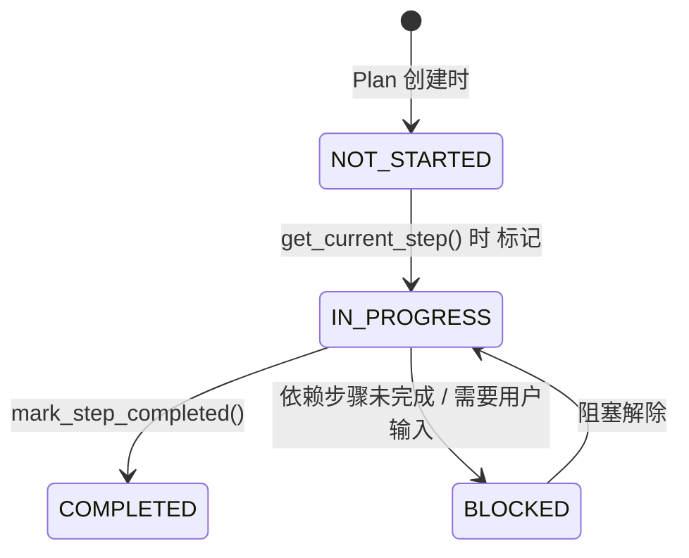

| 标记 | 状态 | 含义 |
| :--- | :--- | :--- |
| `[ ]` | `NOT_STARTED` | 尚未开始 |
| `[→]` | `IN_PROGRESS` | 正在执行 |
| `[✓]` | `COMPLETED` | 已完成 |
| `[!]` | `BLOCKED` | 被阻塞 (需要用户确认或前置步骤未完成) |

#### 2.6.4 卡死检测与恢复

| 机制 | 阈值 | 处理策略 |
| :--- | :--- | :--- |
| **重复响应检测** | 连续 2 次相同 assistant 内容 | 注入 "尝试新策略" 提示，避免循环 |
| **max_steps 上限** | 30 步 / 每个 Plan 步骤 | 强制终止，标记步骤为 BLOCKED |
| **max_observe 截断** | 10000 字符 | 工具输出过长时截断，防止 Token 溢出 |
| **Token 溢出** | 模型 context 上限 | 捕获 `TokenLimitExceeded`，优雅终止 |

### 2.7 工具集定义 (Tool Registry)

#### 2.7.1 核心工具列表

| # | 工具名称 | 类别 | 描述 | Input | Output |
| :--- | :--- | :--- | :--- | :--- | :--- |
| T1 | `PythonExecute` | 代码执行 | 在 E2B 沙箱中运行 Python 代码 | `code: str` | `stdout + stderr + figures` |
| T2 | `BrowserUseTool` | 浏览器 | 控制浏览器进行搜索/信息提取 | `action: str, url?: str` | `page_content + screenshot` |
| T3 | `StrReplaceEditor` | 文件编辑 | 创建/编辑代码和文档文件 | `path, content/old_str/new_str` | `success/error` |
| T4 | `SearchLiterature` | 文献检索 | Semantic Scholar + Vector DB 搜索 | `query, filters` | `papers[{title, url, score}]` |
| T5 | `ClassifyProblem` | NLP 分析 | 赛题题型分类 + 实体提取 | `text: str` | `{type, variables, constraints, objective}` |
| T6 | `QueryMathKG` | 知识图谱 | 查询数学建模知识图谱 | `topic: str` | `{algorithms, pros_cons, examples}` |
| T7 | `LaTeXCompile` | 文档编译 | xelatex 编译生成 PDF | `tex_source: str` | `pdf_url + compile_log` |
| T8 | `ComplianceCheck` | 合规检查 | MCM/CUMCM 格式合规扫描 | `document, rules` | `{passed: bool, violations[]}` |
| T9 | `AskHuman` | 人机交互 | 向用户提问 (Gate 确认等) | `question: str` | `user_response: str` |
| T10 | `Terminate` | 流程控制 | 结束当前任务 | `status: str` | - |
| T11 | `Planning` | 计划管理 | 创建/更新/标记计划步骤 | `command, plan_id, steps?` | `plan_status` |

#### 2.7.2 工具与数学建模阶段映射

```mermaid
graph LR
    subgraph Phase1 [破题阶段]
        T5[ClassifyProblem]
        T4[SearchLiterature]
        T2[BrowserUseTool]
    end
    
    subgraph Phase2 [策划阶段]
        T6[QueryMathKG]
        T9_1[AskHuman — Gate]
    end
    
    subgraph Phase3 [代码阶段]
        T1[PythonExecute]
        T3[StrReplaceEditor]
    end
    
    subgraph Phase4 [论文阶段]
        T3_2[StrReplaceEditor]
        T7[LaTeXCompile]
        T8[ComplianceCheck]
    end
    
    subgraph Core [全阶段通用]
        T9[AskHuman]
        T10[Terminate]
        T11[Planning]
    end

    style Phase1 fill:#1b4332
    style Phase2 fill:#14213d
    style Phase3 fill:#3d0c11
    style Phase4 fill:#3d1c02
    style Core fill:#212529
```

#### 2.7.3 MathModelingAgent System Prompt

```python
SYSTEM_PROMPT = """
你是数学建模智能助手 (MathModeler)，一个全能型 AI Agent，专门解决数学建模竞赛 (MCM/ICM/CUMCM/APMCM) 中的各类任务。

你拥有以下工具:
- PythonExecute: 在安全沙箱中执行 Python 代码 (支持 SciPy, NumPy, Pandas, Scikit-learn, PyTorch, NetworkX, Matplotlib)
- BrowserUseTool: 浏览网页搜索信息和文献
- StrReplaceEditor: 创建和编辑文件
- SearchLiterature: 检索学术文献
- ClassifyProblem: 分析和分类赛题
- QueryMathKG: 查询数学建模知识图谱
- LaTeXCompile: 编译 LaTeX 文档为 PDF
- ComplianceCheck: 检查论文格式是否符合竞赛要求
- AskHuman: 在需要用户确认时向用户提问
- Terminate: 完成任务时调用

工作目录: {directory}

请根据用户需求，主动选择最合适的工具或工具组合。对于复杂任务，请分步骤解决问题。
每使用一个工具后，清晰解释执行结果并建议下一步操作。
"""

NEXT_STEP_PROMPT = """
基于当前任务进展和 memory 中的上下文信息，选择最合适的下一步操作:
1. 如果需要分析题目 → 使用 ClassifyProblem
2. 如果需要搜索文献 → 使用 SearchLiterature 或 BrowserUseTool
3. 如果需要选择算法 → 使用 QueryMathKG
4. 如果需要编写/执行代码 → 使用 PythonExecute + StrReplaceEditor
5. 如果需要编译论文 → 使用 LaTeXCompile
6. 如果需要用户确认决策 → 使用 AskHuman
7. 如果任务全部完成 → 使用 Terminate
"""
```

---

## 三、 细节方案

### 3.1 功能详述：阶段一 — 智能破题 (Inception)

#### 3.1.1 页面原型与交互说明

- **UI 设计稿**: `[待补充 Figma 链接]`
- **交互逻辑**:
  1. **初始状态**: Canvas 区域显示上传引导界面，支持拖拽 PDF 或文本粘贴。
  2. **触发操作**: 用户上传文件 → Canvas 进入"解析中"加载态 → Chat Panel 显示 Analyst 的 Thinking 过程。
  3. **成功状态**: Canvas 展示结构化的《题目理解报告》卡片，包含：问题重述、核心难点、变量定义表、推荐模型类别。右栏展示关联文献列表。
  4. **Gate 1 交互**: Canvas 底部出现 `Approve` / `Edit` / `Reject` 按钮。点击 Edit 后可直接修改报告中的条目。
  5. **失败状态**: 若解析失败 (如 PDF 无法识别)，Chat Panel 展示错误提示并建议用户手动粘贴文本。

- **数据需求**: 前端传递 `file_id` (上传后获得) → 后端返回 `report` JSON。

**详细处理步骤**:

| 步骤 | Agent | Input | Processing | Output |
| :--- | :--- | :--- | :--- | :--- |
| 1. 题目上传 | User | PDF / Image / Text | - | 原始文件 |
| 2. 文本提取 | Analyst | 原始文件 | PDF 解析 / OCR (Tesseract) / NLP Tokenize | 结构化文本 |
| 3. 实体提取 | Analyst | 结构化文本 | NER + Dependency Parsing | JSON: `{objective, constraints[], variables[]}` |
| 4. 题目分类 | Analyst | JSON Entities | 规则引擎 + LLM 分类器 | 类型标签: `optimization / prediction / evaluation` |
| 5. 关键词生成 | Analyst | JSON + 分类 | LLM: "Generate 5 search queries" | 检索词列表 |
| 6. 文献检索 | Critic | 检索词 | Semantic Scholar API + BM25 + Vector Search | 候选文献集 (50+) |
| 7. 文献过滤 | Critic | 候选集 | 引用数阈值 + 时效性 + Cross-Encoder Re-ranking | 精选列表 (5-10) |
| 8. 报告生成 | Analyst | 全部上下文 | LLM Summarization + Template Rendering | 《题目理解报告》|

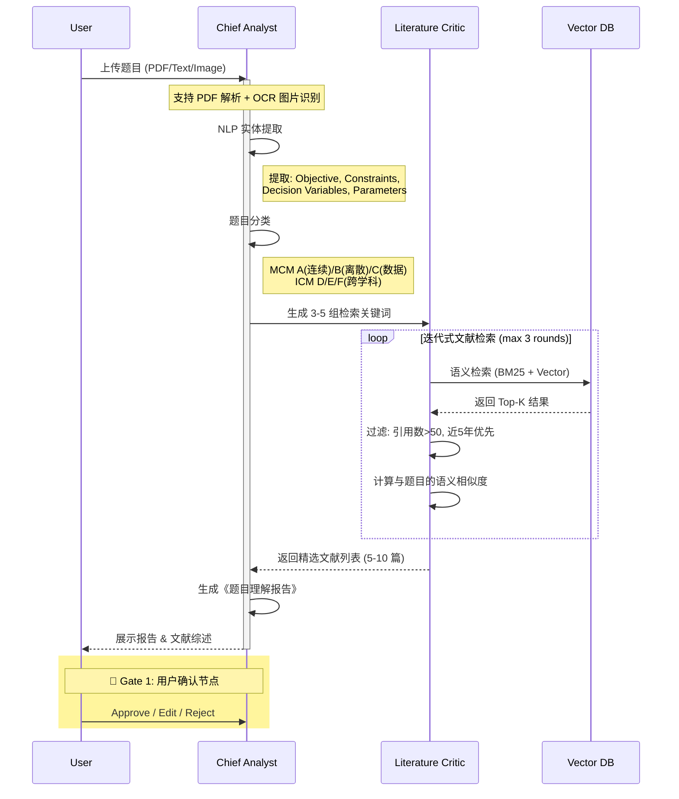

#### 3.1.2 边缘 Case 处理

| Case | 处理逻辑 |
| :--- | :--- |
| 上传的 PDF 为扫描件 (纯图片) | 自动调用 OCR (Tesseract)，若识别置信度 < 70% 提示用户手动粘贴 |
| 题目语言为英文但用户选了中文 | 自动识别语言，切换 NLP pipeline |
| 文献检索无结果 | 扩大关键词范围，降低过滤阈值；若仍无结果，提示"该领域文献较少" |
| 用户反复 Reject 报告 (>3 次) | 提示用户手动补充关键信息，或进入"自由对话模式" |

### 3.2 功能详述：阶段二 — 策略规划 (Strategy)

#### 3.2.1 页面原型与交互说明

- **交互逻辑**:
  1. Gate 1 通过后，Canvas 自动切换为"策略对比表"视图。
  2. Chat Panel 显示 Planner 与 Programmer 的讨论过程 (Thinking 折叠块)。
  3. 生成完毕后，Canvas 展示策略 A/B/C 的对比卡片，用户点选一种策略。
  4. 选定后触发 Gate 2，蓝图冻结 (Blueprint Frozen)。

**策略模板** (根据题型自动推荐):

| 题型 | 策略 A (经典) | 策略 B (进阶) | 策略 C (创新) |
| :--- | :--- | :--- | :--- |
| **优化** | 线性规划 / 整数规划 | 遗传算法 / 模拟退火 | 强化学习 / 量子退火 |
| **预测** | 多元回归 / ARIMA | LSTM / Prophet | Transformer / N-BEATS |
| **评价** | AHP / 熵权法 | TOPSIS / 灰色关联 | 模糊综合评价 / DEA |
| **机理** | 微分方程 / 元胞自动机 | Agent Based Model | 物理信息神经网络 (PINN) |

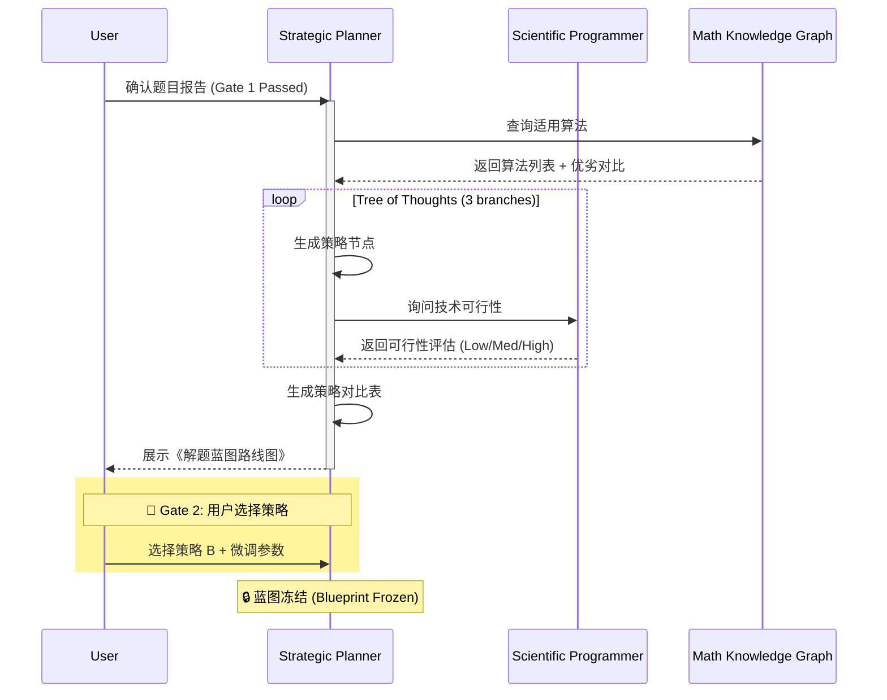

#### 3.2.2 边缘 Case 处理

| Case | 处理逻辑 |
| :--- | :--- |
| 3 种策略可行性都为 Low | 提示用户：题目可能需要补充数据，建议联系出题方确认 |
| 用户对 3 种策略都不满意 | 允许用户自由输入期望的算法名称，Planner 重新生成蓝图 |
| 蓝图冻结后用户反悔 | 支持"解冻"操作，但会清空已有代码成果，需二次确认 |

### 3.3 功能详述：阶段三 — 代码闭环 (Coding Loop)

#### 3.3.1 页面原型与交互说明

- **交互逻辑**:
  1. Gate 2 通过后，Canvas 切换为 **Monaco 代码编辑器**。
  2. Chat Panel 展示 Programmer 的编码过程和 Reviewer 的审查意见。
  3. 右栏 Context 切换为 **Console** (实时 stdout/stderr) + **图表预览面板**。
  4. 代码执行成功且审查通过后，代码自动合并至项目仓库。

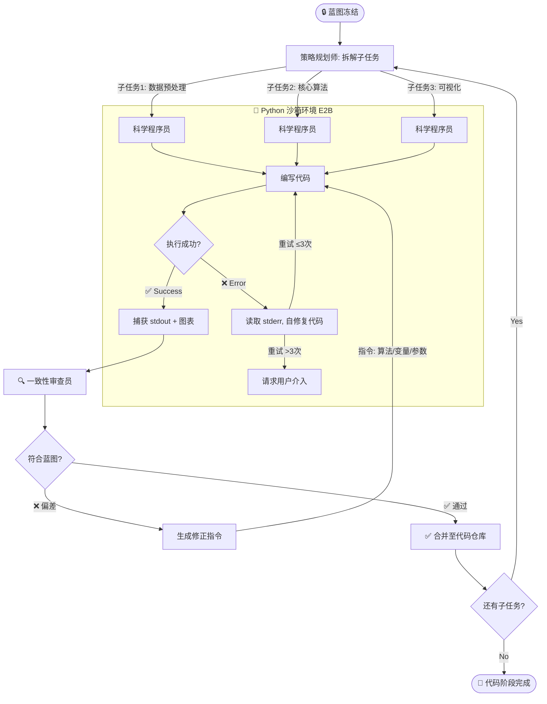

#### 3.3.2 边缘 Case / 错误处理

| 错误类型 | 处理方式 | 最大重试 | 升级策略 |
| :--- | :--- | :--- | :--- |
| `SyntaxError` | Programmer 自动修复语法 | 3 次 | 请求用户提供思路 |
| `ImportError` | 自动 `pip install` 缺失库 | 2 次 | 提示用户手动安装 |
| `RuntimeError` (OOM) | 减小数据集规模 / 降低模型复杂度 | 2 次 | 建议更换算法 |
| `ValueError` (维度不匹配) | 检查数据预处理逻辑 | 3 次 | 交给 Reviewer 分析 |
| **一致性偏差** | Reviewer 发出修正指令 | 2 次 | 提请 Planner 重新评估策略 |

### 3.4 功能详述：阶段四 — 论文写作与合规 (Writing & Compliance)

#### 3.4.1 页面原型与交互说明

- **交互逻辑**:
  1. 代码阶段完成后，Canvas 切换为 **Block Editor** (类 Notion 块级编辑器)。
  2. Editor Agent 自动生成论文大纲 (摘要/问题重述/模型假设/符号说明/求解/结论/附录)。
  3. 用户可通过 `@Editor` / `@Programmer` 召唤 Agent 辅助写作。
  4. 完成写作后提交合规检查，通过后一键导出。

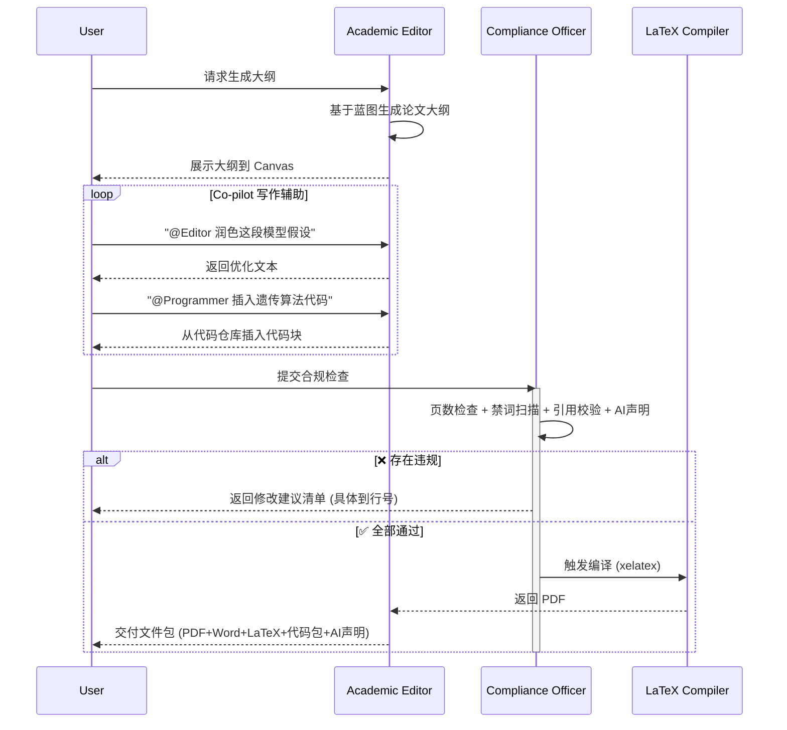

#### 3.4.2 合规检查清单

| 检查项 | 规则 | 竞赛 |
| :--- | :--- | :--- |
| 页数 | MCM ≤ 25, IMMC ≤ 23 | All |
| 禁词 | 校名、姓名、"University" | MCM/ICM |
| 引用格式 | BibTeX 校验, DOI 可达 | All |
| AI 声明 | 自动生成使用报告附录 | MCM/CUMCM |
| 文件命名 | `{控制号}.pdf` | MCM |
| 字体 | Times New Roman 12pt / 宋体 12pt | MCM / CUMCM |
| 页边距 | ≥ 2.5cm | CUMCM |

### 3.5 MathModelingAgent 定义 (对标 Manus)

> [!NOTE]
> 与原 PRD (v2.1) 的 6 个专用 Agent 不同，v2.2 采用 OpenManus 模式：**一个通用 Agent 搭配多种工具**，通过 PlanningFlow 自动编排执行步骤。原有的 "分析师/规划师/程序员/审查员/编辑/合规官" 角色由 MathModelingAgent 通过不同工具调用来扮演。

#### 3.5.1 Agent 配置

| 属性 | 值 |
| :--- | :--- |
| **Name** | `MathModeler` |
| **继承链** | `BaseAgent` → `ReActAgent` → `ToolCallAgent` → `MathModelingAgent` |
| **System Prompt** | 见 §2.7.3 |
| **Next Step Prompt** | 见 §2.7.3 |
| **max_steps** | `30` (每个 Plan 步骤的最大循环次数) |
| **max_observe** | `10000` (工具输出截断长度) |
| **LLM** | 主模型: `MiniMax-M1` / `GPT-4o`, 视觉模型: `GPT-4o` (处理题目图片) |
| **available_tools** | `PythonExecute, BrowserUseTool, StrReplaceEditor, SearchLiterature, ClassifyProblem, QueryMathKG, LaTeXCompile, ComplianceCheck, AskHuman, Terminate` |
| **special_tool_names** | `[Terminate]` — 调用后 Agent 进入 FINISHED 状态 |

#### 3.5.2 原角色 → 工具映射

| 原 v2.1 角色 | v2.2 如何实现 | 使用的工具 |
| :--- | :--- | :--- |
| 首席分析师 (Analyst) | MathModelingAgent 在破题步骤中自动调用 | `ClassifyProblem` + `SearchLiterature` + `BrowserUseTool` |
| 策略规划师 (Planner) | MathModelingAgent 在策划步骤中自动调用 | `QueryMathKG` + `AskHuman` (Gate) |
| 科学程序员 (Programmer) | MathModelingAgent 在代码步骤中自动调用 | `PythonExecute` + `StrReplaceEditor` |
| 一致性审查员 (Reviewer) | MathModelingAgent 执行代码后自动审查 | LLM 推理 (对比 Memory 中的蓝图和代码) |
| 学术编辑 (Editor) | MathModelingAgent 在论文步骤中自动调用 | `StrReplaceEditor` + `LaTeXCompile` |
| 合规官 (Compliance) | MathModelingAgent 在导出前自动调用 | `ComplianceCheck` |

### 3.6 Memory 与上下文管理 — 双层记忆系统 (v3.0 重构)

> [!NOTE]
> v3.0 引入了受 [memU 架构](https://github.com/NevaMind-AI/memU-server) 启发的双层记忆系统，取代了原有的原始字符串拼接方式。原来的 `accumulated_context` 字符串截断被结构化的 MemoryManager 完全替代，每个阶段产出 LLM 生成的综合报告而非步骤原始拼接。

#### 3.6.1 双层架构概览

```
┌───────────────────────────────────────────────────────────────────┐
│                        MemoryManager                              │
│  PlanningFlow 唯一记忆入口 — 屏蔽下层两个实现                        │
│                                                                   │
│  ┌─────────────────────────┐   ┌──────────────────────────────┐  │
│  │   ShortTermMemory        │   │      LongTermMemory          │  │
│  │   (短期记忆)              │   │      (长期记忆)               │  │
│  │                         │   │                              │  │
│  │  • 有界：≤6000字/阶段槽  │   │  • 项目级持久化              │  │
│  │  • 会话级 (session_id)  │   │  • 重要性评分存储            │  │
│  │  • 阶段切换时清空         │   │  • 跨会话跨阶段保留          │  │
│  │  • FIFO 溢出淘汰         │   │  • synthesis=2.0 最高       │  │
│  │  • 最近步骤优先           │   │  • 关键词检索               │  │
│  └─────────────────────────┘   └──────────────────────────────┘  │
└───────────────────────────────────────────────────────────────────┘
```

#### 3.6.2 每步上下文窗口构造

| 层 | 占比 | 内容 |
| :--- | :--- | :--- |
| 长期记忆 | ~45% | 前序阶段综合报告（compact 高价值摘要） |
| 短期记忆 | ~55% | 当前阶段最近步骤（recency-weighted） |

**组装后格式**:
```
## 长期记忆（跨阶段知识）
### 【Inception 综合】
[破题分析报告节选…]

## 短期记忆（当前阶段步骤）
[step_result] 步骤 1 [分析题目]:
[本阶段已完成步骤…]
```

#### 3.6.3 阶段生命周期

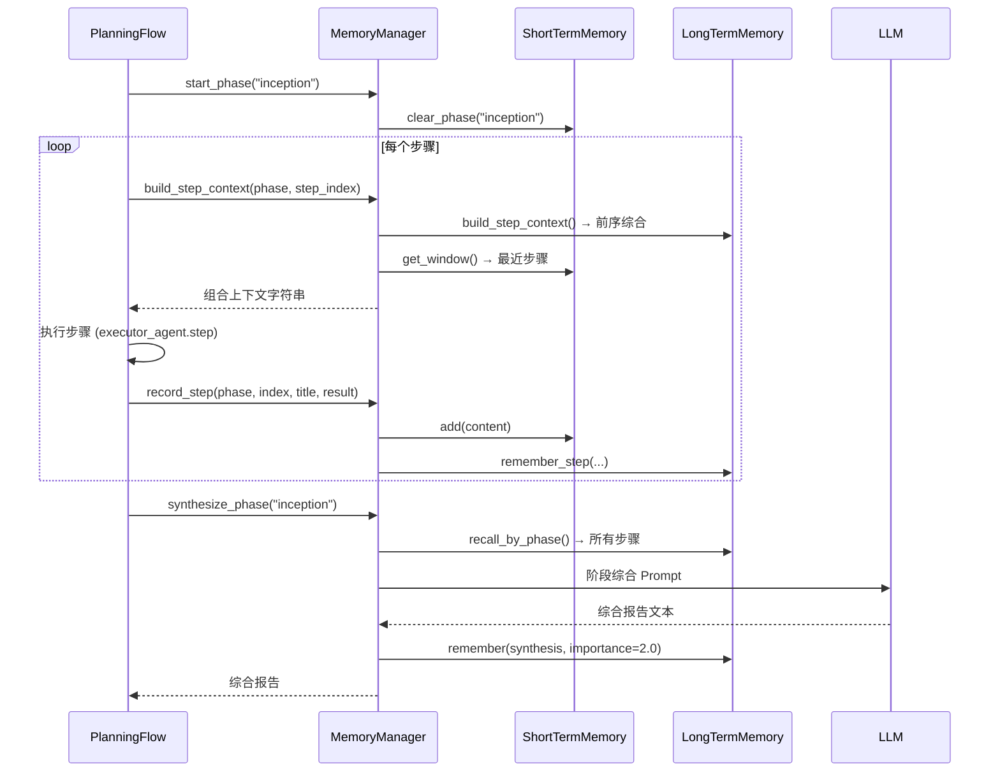

#### 3.6.4 重要性评分体系 (LongTermMemory)

| content_type | importance | 说明 |
| :--- | :--- | :--- |
| `synthesis` | 2.0 | LLM 阶段综合报告 — 最高价值 |
| `user_decision` | 1.8 | 用户 AskHuman 决策 — 显式意图 |
| `key_finding` | 1.5 | 关键发现 |
| `conclusion` | 1.3 | 结论 |
| `result` | 1.0 | 普通步骤结果（默认） |
| `analysis` | 1.0 | 分析 |
| `code` | 0.8 | 代码（信噪比低） |

#### 3.6.5 各阶段 LLM 综合 Prompt 模板

| 阶段 | 产出物 | 篇幅要求 |
| :--- | :--- | :--- |
| Inception (破题) | **问题分析报告** — 背景概述、关键变量、约束分析、题型判断、文献综述 | 800-2000 字 |
| Blueprinting (建模) | **建模方案蓝图** — 模型设计、数学公式 (LaTeX)、算法选择、数据需求、求解流程 | 1000-3000 字 |
| Coding (求解) | **求解结果报告** — 实现概述、关键逻辑、数值结果分析、图表说明、模型验证 | 800-2000 字 |
| Writing (论文) | **论文撰写总结** — 结构说明、各章节摘要、合规检查结果 | 500-1500 字 |

#### 3.6.6 接口说明 (MemoryManager API)

```python
# 初始化 (PlanningFlow._get_or_init_memory())
memory = MemoryManager(executor_agent, project_id, session_id)

# 阶段开始
await memory.start_phase(phase)

# 步骤上下文（执行前调用）
ctx = await memory.build_step_context(phase, step_index, max_chars=4000)

# 步骤记录（执行后调用）
await memory.record_step(phase, step_index, step_title, result_content)

# 用户决策（AskHuman 收到回复后）
await memory.record_user_decision(phase, question, answer)

# 阶段规划上下文（planning_agent 分解步骤前）
plan_ctx = await memory.build_planning_context(phase, fallback=raw_str, max_chars=2000)

# 阶段综合（所有步骤完成后）
synthesis = await memory.synthesize_phase(phase, on_log=log_fn)
```

### 3.7 PlanningFlow 完整示例 (数学建模场景)

以下展示用户输入一道 MCM 赛题后，PlanningFlow 如何自动分解并逐步执行的完整流程：

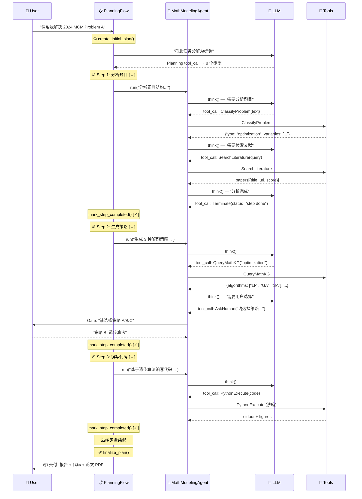

### 3.8 API 设计

#### 3.8.1 RESTful 接口

| Endpoint | Method | 描述 | Request | Response |
| :--- | :--- | :--- | :--- | :--- |
| `/api/v1/projects` | POST | 创建项目 | `{ "title", "competition" }` | `{ "project_id" }` |
| `/api/v1/projects/{id}/upload` | POST | 上传题目 | `multipart/form-data` | `{ "file_id", "status" }` |
| `/api/v1/chat/send` | POST | 发送消息 | `{ "session_id", "content", "mention" }` | `{ "msg_id", "status" }` |
| `/api/v1/workflow/start` | POST | 启动阶段 | `{ "project_id", "phase" }` | `{ "task_id" }` |
| `/api/v1/review/decision` | POST | Gate 决策 | `{ "task_id", "decision", "feedback" }` | `{ "next_state" }` |
| `/api/v1/artifacts/blueprint` | GET | 获取蓝图 | - | `{ "content", "version", "frozen" }` |
| `/api/v1/artifacts/code` | GET | 获取代码 | - | `{ "files", "last_run" }` |
| `/api/v1/artifacts/code/run` | POST | 执行代码 | `{ "code" }` | `{ "stdout", "stderr", "figures" }` |
| `/api/v1/artifacts/paper/export` | POST | 导出论文 | `{ "format": "pdf" }` | `{ "pdf_url", "docx_url", "latex_url" }` |

#### 3.8.2 WebSocket 实时通信

```json
// 连接: ws://host/ws/project/{project_id}

// Server -> Client: Agent 思考消息
{
  "type": "agent_message",
  "agent": "Scientific Programmer",
  "content": "Debugging IndexError on line 42...",
  "metadata": { "phase": "coding", "step": "self_correction" }
}

// Server -> Client: 代码执行结果
{
  "type": "execution_result",
  "stdout": "Optimal value: 42.5",
  "stderr": "",
  "figures": ["data:image/png;base64,..."]
}

// Server -> Client: Gate 请求
{
  "type": "gate_request",
  "gate_id": "gate_1",
  "title": "确认题目理解报告",
  "artifact_id": "report_uuid"
}
```

### 3.9 数据库设计

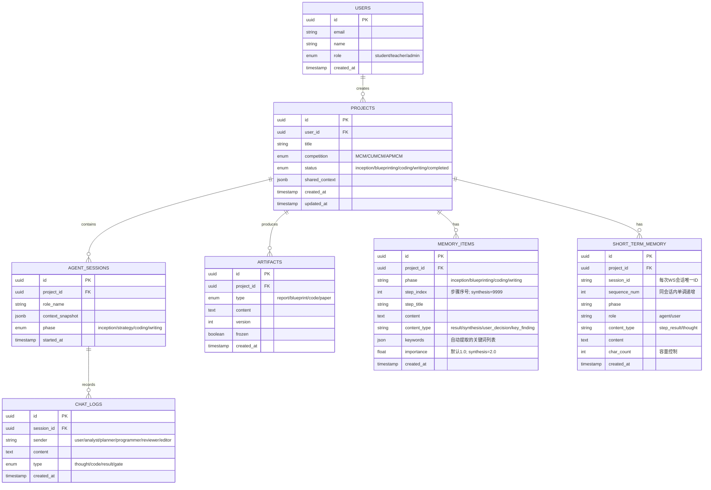

### 3.10 非功能性需求

#### 性能需求

| 指标 | 目标值 | 说明 |
| :--- | :--- | :--- |
| Agent 首次响应 | ≤ 3s | 用户发送消息后首个 Token 出现时间 |
| 代码执行延迟 | ≤ 30s | 沙箱中代码执行完毕 (中等复杂度) |
| 文献检索 | ≤ 5s | 单轮检索返回结果时间 |
| PDF 编译 | ≤ 15s | LaTeX → PDF 编译时间 |
| 并发用户 | ≥ 100 | 同时在线用户数 |

#### 安全需求

| 层面 | 措施 |
| :--- | :--- |
| 代码沙箱 | E2B/gVisor 隔离, 禁止外部网络 (除 pip), CPU/内存限制 |
| 数据隔离 | 项目间严格隔离, 团队权限控制 |
| API 安全 | JWT 认证, HTTPS, Rate Limiting (60 req/min) |
| LLM 安全 | Prompt Injection 防护, Output Guardrails |

#### 兼容性需求

- 浏览器：Chrome 110+, Safari 16+, Firefox 110+, Edge 110+
- 移动端：暂不支持 (V2.0 考虑响应式适配)

#### 数据统计 / 埋点需求

| 事件名称 | 触发时机 | 页面/位置 | 上报参数 | 备注 |
| :--- | :--- | :--- | :--- | :--- |
| `project_create` | 创建新项目 | 首页 | `competition_type` | |
| `file_upload` | 上传题目文件 | 工作台 | `file_type, file_size` | |
| `gate_decision` | 用户在 Gate 做决策 | 工作台-Canvas | `gate_id, decision, phase` | 核心漏斗 |
| `code_execute` | 代码在沙箱中执行 | 工作台-Console | `success, duration_ms, error_type` | |
| `code_self_fix` | Programmer 触发自修复 | - | `error_type, retry_count` | |
| `consistency_check` | Reviewer 审查结果 | - | `verdict, issues_count` | |
| `paper_export` | 导出论文 | 导出面板 | `format, page_count, compliance_passed` | |
| `compliance_fail` | 合规检查失败 | - | `fail_reason[]` | 追踪常见问题 |

#### 可观测性

| 维度 | 工具 | 监控内容 |
| :--- | :--- | :--- |
| Logging | ELK Stack | Agent 对话、API 请求日志 |
| Metrics | Prometheus + Grafana | Token 用量、代码成功率、API 延迟 P99 |
| Tracing | Jaeger / OpenTelemetry | 多 Agent 调用链追踪 |

### 3.11 技术栈

| 层级 | 技术 | 用途 |
| :--- | :--- | :--- |
| Agent Framework | Camel AI (Python) | 核心多智能体调度 |
| LLM | MiniMax-M1 + DeepSeek Math V2 | 推理 + 验证 |
| Code Sandbox | OpenSandbox（自托管）/ E2B（云端）/ 本地 subprocess（三级降级） | 安全 Python 执行 |
| Backend | FastAPI + Celery + Redis | API + 异步任务 |
| Database | PostgreSQL + pgvector | 关系数据 + 向量检索 |
| Frontend | HTML5 + CSS3 + Vanilla JS + WebSocket | UI + 实时通信 (零构建依赖) |
| Document | PyLaTeX + KaTeX + Pandoc | LaTeX 生成/渲染/转换 |
| Monitoring | Prometheus + Grafana + ELK | 可观测性 |
| Deployment | Docker Compose / K8s | 容器化部署 |

### 3.12 环境配置 (Environment Requirements)

#### 3.12.1 开发环境
-   **Python**: 3.11+（需 Homebrew `python@3.11`，`opensandbox` 包要求 ≥3.10）
-   **依赖管理**: `pip install -r requirements.txt` (见 backend/requirements.txt)
-   **数据库**: SQLite (Dev) / PostgreSQL (Prod)

#### 3.12.2 本地工具依赖
-   **LaTeX**: 推荐安装 `TeXLive` 或 `MiKTeX`，并确保 `xelatex` 命令可用。
    -   *用途*: 用于 T7 (LaTeXCompile) 工具将论文源码编译为 PDF。
    -   *降级*: 若未安装，系统仅生成 `.tex` 源码，不影响其他流程。
-   **Python Data Science**: 用于本地沙盒执行 (`python_execute` local provider)。
    -   *必需库*: `numpy`, `pandas`, `scipy`, `matplotlib`, `networkx`, `sympy`, `scikit-learn`, `torch`。

#### 3.12.3 核心 Python 包版本

| 包 | 版本 | 用途 |
| :--- | :--- | :--- |
| `fastapi` | ≥0.115 | Web 框架 |
| `camel-ai` | 0.2.89 | AI Agent 框架 |
| `opensandbox` | 0.1.5 | 代码沙箱（自托管，主选） |
| `opensandbox-code-interpreter` | 0.1.1 | OpenSandbox 代码执行客户端 |
| `opensandbox-server` | 0.1.4 | OpenSandbox 自托管服务器 |
| `e2b-code-interpreter` | 2.4.1 | 代码沙箱（云端，备选） |
| `sqlalchemy` | ≥2.0 | ORM |
| `aiosqlite` | ≥0.20 | 异步 SQLite |
| `openai` | ≥1.60 | LLM API 客户端 |

---

## 四、 上线计划与运营

### 4.1 上线排期 (Roadmap)

| 里程碑 | 时间 | 交付物 |
| :--- | :--- | :--- |
| 需求评审 | 2026-02 | PRD 终稿 |
| UI/UX 设计 | 2026-03 | Figma 设计稿 + 交互原型 |
| Sprint 1: 破题模块 | 2026-03 ~ 2026-04 | R001-R004 |
| Sprint 2: 策划模块 | 2026-04 ~ 2026-05 | R005-R006 |
| Sprint 3: 代码模块 | 2026-05 ~ 2026-06 | R007-R009 |
| Sprint 4: 论文模块 | 2026-06 ~ 2026-07 | R010-R013 |
| 集成测试 | 2026-07 ~ 2026-08 | 全流程联调 |
| **MVP 上线** | **2026-08** | **完整四阶段 + 基础 UI** |
| CUMCM 实战验证 | 2026-09 | 收集真实用户反馈 |

### 4.2 灰度发布计划

- **第一阶段** (`2026-08`): 对内部团队 + 10 支种子队伍开放 (Closed Beta)。
- **第二阶段** (`2026-09`): 对 CUMCM 参赛队伍开放 5% 流量。
- **第三阶段** (`2026-10`): 根据反馈逐步放量至 50%、100%。

### 4.3 成功指标 (上线后追踪)

| 指标 | 目标 | 衡量方式 |
| :--- | :--- | :--- |
| 代码一次通过率 | > 60% | `code_execute` 事件 success 率 |
| 一致性拦截率 | > 90% | `consistency_check` verdict=fail / 总偏差数 |
| 文献相关性 | > 80% | 用户在 Gate 1 对文献的采纳率 |
| 论文格式合规率 | 100% | `compliance_fail` 事件为 0 |
| Gate 通过率 | > 70% | `gate_decision` approve / 总决策数 |
| 用户满意度 (NPS) | > 40 | 问卷调查 |

---

## 五、 附录

### 5.1 竞赛格式规范速查表

| 竞赛 | 语言 | 页数 | 格式 | 大小 | 字体 | 页边距 | 特殊要求 |
| :--- | :--- | :--- | :--- | :--- | :--- | :--- | :--- |
| MCM/ICM | English | ≤25 | PDF | ≤20MB | Times New Roman 12pt | - | 控制号命名, AI报告 |
| CUMCM | 中文 | 无硬限 | PDF/Word | - | 黑体16pt/宋体12pt | ≥2.5cm | 首页承诺书 |
| APMCM | 中/英 | 无硬限 | PDF/Word | - | - | - | 诚信声明 |
| IMMC | English | ≤23 | PDF | ≤17MB | - | - | 96h 完成 |

### 5.2 Q&A

- **Q1: Agent 生成的代码是否完整可直接提交?**
- **A1**: 不是。系统提供代码骨架和辅助实现，核心建模逻辑仍需学生理解和调整。所有 AI 辅助内容会自动记录到 AI 使用声明附录。

- **Q2: 如果 LLM 产生幻觉 (Hallucination) 怎么办?**
- **A2**: 通过三层防护：1) RAG 确保事实有据可查；2) Reviewer Agent 一致性审查；3) 用户 Gate 人工确认。

- **Q3: 为什么选择 Camel AI 而不是 LangChain?**
- **A3**: Camel AI 原生支持 Role-Playing 和 Critic 机制，与本项目的多 Agent 协作场景天然匹配；LangChain 更偏向 Chain/Pipeline 模式。

- **Q4: 系统是否支持 MATLAB?**
- **A4**: V1.0 仅支持 Python (E2B 沙箱)。MATLAB 支持列入 V2.0 评估。

### 5.3 E2E 测试报告 (2026-02-21)

> [!IMPORTANT]
> 使用 **2024 APMCM Problem A (水下图像增强)** 进行全流程端到端测试。

#### 测试环境

| 项目 | 配置 |
| :--- | :--- |
| LLM Provider | MiniMax (`abab6.5-chat`) via OpenAI Compatibility |
| Backend | FastAPI + Uvicorn, Python 3.9 |
| Frontend | 静态 HTML/CSS/JS, `python -m http.server 3000` |
| Database | SQLite + aiosqlite |

#### 发现的 Bug 及修复

| # | Bug | 根因 | 影响 | 修复文件 | 状态 |
| :--- | :--- | :--- | :--- | :--- | :--- |
| 1 | Agent 返回 "Lorem Ipsum" 占位文本 | `config.py` 未加载 `.env`，LLM 配置回退为默认值（空 API key），使用了 StubModel | **P0** — Agent 无法执行任何真实分析 | `config.py`: 添加 `load_dotenv()` | ✅ 已修复 |
| 2 | 制品面板不刷新 | `app.js` 的 `assistant_message` WS handler 未重新拉取 artifacts | **P1** — 用户看不到生成的制品 | `app.js`: WS handler 中追加 `loadArtifacts()` + `renderArtifactsPanelOnly()` | ✅ 已修复 |
| 3 | 点击输入区域无法聚焦 textarea | `app.js` 缺少容器 → textarea 的点击委托 | **P2** — 用户体验问题 | `app.js`: `.input-wrapper` click → `chatInput.focus()` | ✅ 已修复 |
| 4 | 策划阶段 (Blueprinting) 启动即崩溃: `chat content is empty (2013)` | `planning.py` 将完整 inception 上下文 (~数千字) 直接拼入消息，超出 minimax token 限制导致内容被截断为空 | **P0** — Agent 无法进入第 2 阶段 | `planning.py`: 截断 `accumulated_context` (2000 chars) + 注入阶段提示词 + 失败重试 | ✅ 已修复（v3.0 双层记忆系统从根本上解决了此问题） |

#### 测试结果

| 阶段 | 步骤数 | 耗时 | 制品 | 状态 |
| :--- | :--- | :--- | :--- | :--- |
| Inception (破题) | 12 | ~6 min | `report` | ✅ 完成 |
| Blueprinting (策划) | 18 | ~10 min (估) | `blueprint` | ✅ 运行中 |
| Coding (编码) | — | — | `code` | ⏳ 待验证 |
| Writing (论文) | — | — | `paper` | ⏳ 待验证 |
